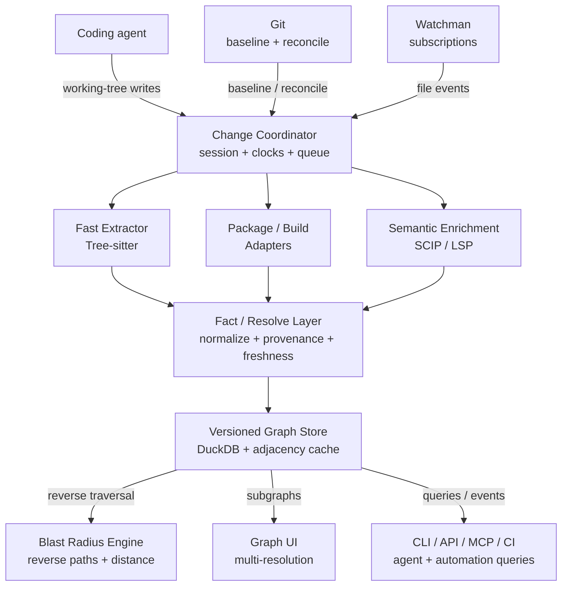

# Live Repository Impact Graph

## Product & Technical Specification

| **Status**        | Draft v0.1                                                           |
|-------------------|----------------------------------------------------------------------|
| **Date**          | 26 August 2026                                                       |
| **Audience**      | Product, engineering, developer tools, agent platform                |
| **Working scope** | Local-first live dependency graph for coding-agent change monitoring |

> **Core thesis:** The product does not primarily track source diffs. It tracks graph mutations caused by working-tree changes, then computes and explains the reverse dependency closure - the blast radius - at repository, package, file, build-target, and eventually symbol level.

**Document intent.** Define the product boundary, canonical graph model, change-processing pipeline, reuse strategy, MVP, and acceptance criteria for a system that observes changes made by a coding agent and continuously updates an explainable model of repository impact.

**Key architectural stance.** Git, filesystem watchers, package managers, build systems, Tree-sitter, SCIP indexers, and LSPs are evidence providers. The canonical source of product truth is a versioned repository graph with explicit provenance and freshness.

## 1. Executive Summary

Coding agents can modify a repository faster than a human can maintain a mental model of the architectural consequences. Traditional Git tooling answers what text changed. This project answers a different question: what relationships changed, and what parts of the system can be affected as a result?

The proposed system runs against a local working tree, captures a Git baseline at the start of an agent session, subscribes to live file changes, incrementally refreshes dependency evidence, materializes that evidence into a versioned graph, and computes reverse dependency paths from changed nodes. The graph is presented through a multi-resolution UI that can move between repository, package, filesystem, file, build-target, and symbol perspectives.

> **Primary product behavior:** A file save should quickly change the graph state, not merely add a line to a diff. The user should immediately see the changed file, the package or build target it belongs to, the direct dependents, the transitive dependents, and the path that explains each impact.

### 1.1 Proposed MVP stack

| **Layer**               | **Recommended first implementation**         | **Role**                                                                           |
|-------------------------|----------------------------------------------|------------------------------------------------------------------------------------|
| Repository baseline     | Git                                          | Authoritative baseline, dirty state, reconciliation, rename detection              |
| Live file monitoring    | Watchman                                     | Low-latency recursive subscriptions and race-resistant change clocks               |
| Fast structural parsing | Tree-sitter                                  | Incremental syntax, imports/exports/declarations, tolerates incomplete edits       |
| Package/build adapters  | Native ecosystem/build metadata              | Resolve package ownership and explicit dependency edges                            |
| Semantic enrichment     | SCIP + targeted LSP                          | Resolved symbols, references, definitions, call/type relationships where available |
| Graph store             | DuckDB initially + in-memory adjacency cache | Local persistence, temporal facts, fast traversal materialization                  |
| Blast-radius engine     | Custom reverse traversal                     | Explainable direct/transitive impact computation                                   |
| Graph UI                | Cytoscape.js initially                       | Compound/nested graph view and interactive abstraction changes                     |

### 1.2 What is intentionally new

- A build-system-independent canonical graph that merges filesystem, package, build, import, and semantic relationships.

- A temporal model for the working tree: baseline graph, current graph, and relationship changes during an agent session.

- A live change pipeline that handles uncommitted edits instead of waiting for a commit or CI run.

- An explainable blast-radius model that can project a changed file upward to package/build boundaries and downward to symbols.

- A multi-resolution UI designed around changed nodes and impact paths rather than general-purpose code browsing.

## 2. Problem Statement

A coding agent can touch multiple files, add or remove imports, move code across package boundaries, alter package manifests, and change build dependencies within a single session. Git can identify modified files and textual diffs, but it does not provide a continuously updated architectural model of the working tree. Existing build systems can compute affected targets inside their own graph. Existing code-intelligence systems can index symbols and references. Existing file watchers can report changes. The product gap is the integration of these capabilities into one live, local, explainable graph that follows an agent session.

### 2.1 User questions the product must answer

- Which files has the agent changed since this session started?

- Which package, workspace project, or build target owns each changed file?

- Which dependencies were added, removed, or redirected by those edits?

- Which packages/files/symbols depend directly on what changed?

- What is the transitive blast radius, and why is each node included?

- How has the dependency topology changed during the session?

- Is the graph current, partially stale, or waiting for a semantic indexer?

- Can I inspect the same repository as a filesystem hierarchy, package graph, dependency graph, or impact graph?

## 3. Product Goals and Non-Goals

### 3.1 Goals

- Load a local repository with minimal setup and establish a Git-backed baseline.

- Observe uncommitted working-tree changes continuously while a coding agent operates.

- Maintain package/file dependency relationships incrementally, including dependency topology changes.

- Support multiple sources of structural and semantic evidence without coupling the core to one LSP or build system.

- Compute direct and transitive blast radius at multiple abstraction levels.

- Explain every impact result with concrete graph paths and evidence provenance.

- Expose a smooth graph interface that can collapse and expand repository, package, directory, file, build-target, and symbol nodes.

- Operate locally by default and avoid requiring source upload to an external service.

- Be extensible to more languages, build systems, and coding-agent integrations through adapters.

### 3.2 Non-goals for MVP

- A replacement for Git diff, blame, merge, or review workflows.

- Perfect static analysis across every language on day one.

- A complete compiler or new language server implementation.

- A full runtime dependency profiler or distributed tracing product.

- Automatic correctness proof that an impacted component is actually broken.

- A global enterprise code search platform spanning many organizations and repositories in the first release.

- An opaque AI-generated risk score without traceable dependency paths.

## 4. Core Concepts and Terminology

| **Term**        | **Definition**                                                                                                                      |
|-----------------|-------------------------------------------------------------------------------------------------------------------------------------|
| Baseline        | The repository state against which an agent session is measured, normally a Git commit SHA plus the graph snapshot derived from it. |
| Generation      | A monotonically increasing local graph version produced as change events are processed.                                             |
| Fact            | A provider-supplied assertion such as file A imports file B, package X depends on package Y, or symbol S references symbol T.       |
| Canonical graph | The normalized node/edge model produced by resolving and merging provider facts.                                                    |
| Graph mutation  | An added, removed, replaced, or freshness-changed node/edge between two generations.                                                |
| Blast radius    | The set of reverse-reachable nodes from a changed node under a configured set of traversable dependency edges.                      |
| Projection      | Mapping between abstraction levels, such as file -> owning package or file -> declared symbols.                                   |
| Provenance      | The provider, extractor version, source artifact, timestamp/generation, and optional confidence attached to a fact.                 |
| Freshness       | Whether graph information reflects the current working tree, a recent successful parse/index, or a stale last-known-good state.     |

## 5. Functional Requirements

Priority legend: P0 = required for MVP; P1 = high-priority extension; P2 = later capability.

### 5.1 Repository onboarding and session control

| **ID** | **Capability**           | **Requirement**                                                                                                                                         | **Pri.** |
|--------|--------------------------|---------------------------------------------------------------------------------------------------------------------------------------------------------|----------|
| FR-01  | Open repository          | Given a local path inside a Git working tree, identify the repository root, current HEAD, branch/detached state, ignore rules, and initial dirty files. | P0       |
| FR-02  | Agent session baseline   | Create a named session with a baseline commit SHA, baseline graph generation, start time, and watcher clock.                                            | P0       |
| FR-03  | Session reset            | Allow the user to move the baseline to the current state without rebuilding unchanged graph data.                                                       | P1       |
| FR-04  | Repository configuration | Support exclude/include rules for generated code, vendor directories, binary assets, and large files.                                                   | P0       |

### 5.2 Live change detection

| **ID** | **Capability**        | **Requirement**                                                                                                                            | **Pri.** |
|--------|-----------------------|--------------------------------------------------------------------------------------------------------------------------------------------|----------|
| FR-05  | Filesystem events     | Subscribe to create, modify, delete, and rename-like events for files under the repository root.                                           | P0       |
| FR-06  | Burst coalescing      | Coalesce atomic-save and multi-write bursts into stable per-file work items while preserving ordering.                                     | P0       |
| FR-07  | Git reconciliation    | Periodically and on demand reconcile watcher state against Git working-tree state to detect missed events and authoritative changed files. | P0       |
| FR-08  | Rename reconciliation | Use Git rename detection or equivalent evidence during reconciliation so delete/create pairs can preserve file identity where reliable.    | P1       |
| FR-09  | Change feed           | Expose a stream of changed files with event type, generation, timestamp, and current processing/freshness state.                           | P0       |

### 5.3 Package and build graph

| **ID** | **Capability**        | **Requirement**                                                                                                          | **Pri.** |
|--------|-----------------------|--------------------------------------------------------------------------------------------------------------------------|----------|
| FR-10  | Package discovery     | Detect package/workspace boundaries from ecosystem manifests and build-system metadata.                                  | P0       |
| FR-11  | Ownership mapping     | Map every indexed source file to zero, one, or more owning package/build nodes with provenance.                          | P0       |
| FR-12  | Dependency extraction | Create normalized package/build dependency edges from authoritative ecosystem/build metadata where available.            | P0       |
| FR-13  | Topology updates      | When a manifest or build definition changes, refresh only the affected portion of the package/build graph when feasible. | P0       |
| FR-14  | Multiple adapters     | Permit multiple adapters to contribute facts to the same repository without changing the canonical graph schema.         | P1       |

### 5.4 File and semantic graph

| **ID** | **Capability**             | **Requirement**                                                                                                                                  | **Pri.** |
|--------|----------------------------|--------------------------------------------------------------------------------------------------------------------------------------------------|----------|
| FR-15  | Fast structural parse      | Incrementally extract imports/exports, declarations, modules, and other language-specific structure from changed files.                          | P0       |
| FR-16  | Resolved file dependencies | Resolve local import/include/module paths into file-to-file dependency edges where possible.                                                     | P0       |
| FR-17  | Semantic baseline import   | Support ingestion of compiler/indexer output such as SCIP for precise symbol definitions and references.                                         | P1       |
| FR-18  | Targeted LSP enrichment    | Query language servers for current definitions/references/call or type hierarchy information when it materially improves changed regions.        | P1       |
| FR-19  | Partial failure handling   | If a file is temporarily invalid during editing, preserve last-known-good semantic facts as explicitly stale rather than silently deleting them. | P0       |

### 5.5 Temporal graph and graph mutation

| **ID** | **Capability**      | **Requirement**                                                                                                                 | **Pri.** |
|--------|---------------------|---------------------------------------------------------------------------------------------------------------------------------|----------|
| FR-20  | Versioned facts     | Store the generation in which each fact became valid and the generation in which it was superseded or removed.                  | P0       |
| FR-21  | Graph delta         | Compute node/edge additions, removals, and relationship redirects between the session baseline and current generation.          | P0       |
| FR-22  | Provider provenance | Every non-trivial relationship must retain provider and freshness metadata; confidence is required for heuristic relationships. | P0       |
| FR-23  | Snapshot query      | Allow queries against baseline, current, and selected historical generations retained in the session.                           | P1       |

### 5.6 Blast radius

| **ID** | **Capability**    | **Requirement**                                                                                                              | **Pri.** |
|--------|-------------------|------------------------------------------------------------------------------------------------------------------------------|----------|
| FR-24  | Direct impact     | Return immediate reverse dependencies for a changed file/package/build target/symbol.                                        | P0       |
| FR-25  | Transitive impact | Return transitive reverse dependencies with configurable maximum depth and edge-type filters.                                | P0       |
| FR-26  | Explainability    | For every impacted node, return at least one dependency path from that node to a changed node.                               | P0       |
| FR-27  | Distance metrics  | Return minimum graph distance and abstraction-aware distance where relevant (for example package distance vs file distance). | P0       |
| FR-28  | Multiple seeds    | Compute the union and overlap of impact from multiple changed nodes in a session.                                            | P0       |
| FR-29  | Impact deltas     | Distinguish impact caused by a changed implementation from impact caused by a new/removed dependency relationship.           | P1       |

### 5.7 Graph experience

| **ID** | **Capability**     | **Requirement**                                                                                                                     | **Pri.** |
|--------|--------------------|-------------------------------------------------------------------------------------------------------------------------------------|----------|
| FR-30  | Abstraction switch | Switch among repository/package, filesystem, file dependency, build-target, and symbol views without losing the current selection.  | P0       |
| FR-31  | Semantic zoom      | Collapse or expand compound nodes so package nodes can reveal files and file nodes can reveal symbols.                              | P0       |
| FR-32  | Impact mode        | Highlight changed nodes, direct impact, transitive impact, and unaffected context as distinct visual states.                        | P0       |
| FR-33  | Path explanation   | Selecting an impacted node shows one or more dependency paths and the evidence backing each edge.                                   | P0       |
| FR-34  | Temporal compare   | Show relationship additions/removals between baseline and current generation; source-line diff display is optional and not central. | P1       |
| FR-35  | Filtering          | Filter by package, directory, language, edge type, changed state, freshness, and impact depth.                                      | P0       |

### 5.8 Interfaces and integrations

| **ID** | **Capability**      | **Requirement**                                                                                                  | **Pri.** |
|--------|---------------------|------------------------------------------------------------------------------------------------------------------|----------|
| FR-36  | Local API           | Expose graph, change, and impact queries through a local API used by the UI and automation.                      | P0       |
| FR-37  | Event stream        | Expose live graph updates over a streaming interface such as WebSocket or server-sent events.                    | P0       |
| FR-38  | CLI                 | Provide commands for init/open, watch, status, changed, graph, blast-radius, reconcile, and snapshot operations. | P0       |
| FR-39  | Agent query surface | Expose read-only graph and blast-radius queries to coding agents, with MCP as a strong candidate integration.    | P1       |
| FR-40  | CI mode             | Permit headless comparison between two Git revisions for affected-package/build-target output.                   | P1       |

## 6. Non-Functional Requirements

| **ID** | **Area**             | **Requirement / Target**                                                                                                                                                                                                           |
|--------|----------------------|------------------------------------------------------------------------------------------------------------------------------------------------------------------------------------------------------------------------------------|
| NFR-01 | Responsiveness       | Fast-path file and package impact updates should feel interactive. Initial target: visible changed-file state within 500 ms after watcher settle and package/file graph impact within 1 s for ordinary edits on a warm repository. |
| NFR-02 | Semantic latency     | Precise semantic enrichment may trail the fast path; the UI must represent freshness instead of blocking all impact output.                                                                                                        |
| NFR-03 | Scale                | Design for large monorepos through incremental updates, bounded queries, collapse/aggregation, and avoiding full-graph re-layout on every edit. Concrete repository-size benchmarks must be established during the spike.          |
| NFR-04 | Correctness          | Never silently present stale semantic data as current. Missed watcher events must be recoverable through reconciliation.                                                                                                           |
| NFR-05 | Local-first security | No source code leaves the machine by default. Networked providers must be opt-in and clearly identified.                                                                                                                           |
| NFR-06 | Storage minimization | Do not store full source text in the graph unless required. Prefer paths, hashes, symbol ranges, relationship facts, and metadata; read source on demand.                                                                          |
| NFR-07 | Cross-platform       | Primary target should include macOS and Linux; Windows support depends on watcher/indexer compatibility and should be validated explicitly.                                                                                        |
| NFR-08 | Extensibility        | Adding a language/build/package adapter must not require modifying blast-radius algorithms or UI data contracts.                                                                                                                   |
| NFR-09 | Observability        | Track watcher lag, queue depth, indexing latency, stale fact counts, unresolved imports, adapter failures, and graph update latency.                                                                                               |
| NFR-10 | Determinism          | Given identical repository content and adapter versions, baseline graph output should be stable enough to compare across runs.                                                                                                     |

## 7. System Architecture



### 7.1 Architectural principles

| **Principle**               | **Implication**                                                                                                                                       |
|-----------------------------|-------------------------------------------------------------------------------------------------------------------------------------------------------|
| Graph first, not diff first | Textual changes are inputs. The durable product state is nodes, relationships, generations, and evidence.                                             |
| Providers are replaceable   | Watchers, parsers, build tools, LSPs, and indexers implement adapters into a stable internal schema.                                                  |
| Fast path before precision  | Immediately update what can be known structurally; enrich with compiler/LSP-grade semantics when available.                                           |
| Explicit uncertainty        | Relationships may be current, stale, unresolved, or heuristic. The graph records and displays that state.                                             |
| Explainability over scoring | MVP output is dependency paths and distances. Risk scoring is a later layer over trusted graph facts.                                                 |
| Incremental by ownership    | A file change should invalidate facts owned by that file/manifest/build definition, not trigger a whole-repo rebuild unless required by the provider. |

### 7.2 Change-processing tiers

| **Tier**          | **Trigger**                                      | **Expected output**                                         | **Freshness**            |
|-------------------|--------------------------------------------------|-------------------------------------------------------------|--------------------------|
| T0 - change truth | Watcher event                                    | Changed/deleted/created file state; enqueue work            | Immediate                |
| T1 - structural   | Changed file / manifest                          | Package ownership, imports, declarations, file dependencies | Interactive              |
| T2 - semantic     | Successful targeted index/LSP query              | Resolved symbols, references, call/type edges               | May trail T1             |
| T3 - reconcile    | Settle, explicit command, commit/baseline change | Git truth, rename mapping, adapter-wide corrections         | Authoritative checkpoint |

## 8. Canonical Graph Model

### 8.1 Node types

| **Node**          | **Purpose**                                                                         | **MVP**           |
|-------------------|-------------------------------------------------------------------------------------|-------------------|
| Repository        | Top-level indexed working tree and Git identity                                     | Yes               |
| Workspace/Project | Optional intermediate grouping for monorepo/build-system concepts                   | If detected       |
| Package           | Language/package-manager or workspace package boundary                              | Yes               |
| BuildTarget       | Build-system target such as Bazel/Pants target                                      | Adapter dependent |
| Directory         | Filesystem hierarchy node                                                           | Yes               |
| File              | Source/config/manifest/build file                                                   | Yes               |
| Symbol            | Function/class/method/type/module/etc. with provider-native identity where possible | Phase 2           |
| ExternalPackage   | Dependency outside the repository, normalized by ecosystem coordinates              | P1                |
| AgentSession      | Baseline and generation scope for live monitoring                                   | Yes               |

### 8.2 Core edge types

| **Edge**       | **Example**                                      | **Traversal role**                                    |
|----------------|--------------------------------------------------|-------------------------------------------------------|
| CONTAINS       | Package -> File; Directory -> File             | Projection/navigation; normally not a dependency edge |
| OWNS           | BuildTarget -> File; Package -> File           | Projection/navigation                                 |
| DEPENDS_ON     | Package -> Package; BuildTarget -> BuildTarget | Primary blast-radius edge                             |
| IMPORTS        | File -> File or external module                 | Primary file-level blast-radius edge when resolved    |
| DEFINES        | File -> Symbol                                  | Projection/navigation                                 |
| REFERENCES     | Symbol -> Symbol                                | Semantic blast-radius edge                            |
| CALLS          | Symbol -> Symbol                                | Semantic blast-radius edge, provider-dependent        |
| INHERITS       | Symbol -> Symbol                                | Semantic blast-radius edge, provider-dependent        |
| GENERATED_FROM | Generated file/target -> source                 | Optional directional dependency                       |

### 8.3 Fact provenance schema

```text
Fact {
fact_id
subject_id
predicate
object_id | scalar_value
provider // git, watchman, tree-sitter, scip, lsp:<name>, nx, bazel, ...
provider_version
owner_artifact // file, manifest, build definition, index shard
confidence // exact | high | heuristic | unresolved
freshness // current | stale | pending | invalid
valid_from_generation
valid_to_generation // null while active
observed_at
}
```

The canonical graph may be a materialized view over these facts. Keeping provider facts separate from normalized edges makes it possible to reconcile conflicting evidence, change extractors, and explain why a relationship exists.

### 8.4 Stable identity rules

- Repository identity: normalized repository root plus Git origin/UUID metadata when available.

- Package identity: repository + package root + ecosystem/package coordinate; manifest path is part of provenance, not necessarily the permanent identity.

- File identity: repository + normalized path, with identity migration on confidently detected renames.

- Symbol identity: prefer provider-native stable symbols (for example SCIP symbols); otherwise use language + fully qualified name + file scope + disambiguator.

- Edges are identities over subject/predicate/object/provider, with validity intervals rather than destructive overwrite.

## 9. Temporal Model and Change Semantics

The product should distinguish three related but different states: Git baseline, live working tree, and semantic freshness. A graph generation is not necessarily a Git commit. It is a locally ordered observation of the working tree.

```text
baseline commit A / generation 100
|
| agent edits auth/token.ts
v
generation 101: file marked changed; old semantic facts may be stale
|
| Tree-sitter resolves a new import
v
generation 102: IMPORTS edge added; blast radius recomputed
|
| LSP/SCIP confirms symbol resolution
v
generation 103: semantic edge upgraded to exact/current
|
| agent edits package manifest
v
generation 104: package DEPENDS_ON edge replaced
|
| explicit reconcile
v
generation 105: Git truth + rename/delete correction checkpoint
```

### 9.1 Relationship mutation example

If auth.ts previously imported database/client.ts and the agent redirects it to identity/client.ts, the important product event is not the line diff. It is the removal and addition of graph relationships:

```text
REMOVED: File(auth.ts) --IMPORTS--> File(database/client.ts)
ADDED: File(auth.ts) --IMPORTS--> File(identity/client.ts)
Projected package delta:
REMOVED or weakened: Package(auth) --DEPENDS_ON--> Package(database)
ADDED or strengthened: Package(auth) --DEPENDS_ON--> Package(identity)
```

### 9.2 Invalid intermediate source

Coding agents frequently create syntactically or semantically invalid intermediate states. The system must avoid converting temporary parse failure into false dependency removal. When an extractor cannot produce a trustworthy current result, previous facts remain queryable as stale until a successful parse/index or explicit deletion/reconciliation invalidates them.

## 10. Blast Radius Model

### 10.1 Definition

For a set of changed seed nodes C and a configured set of traversable dependency edges E, blast radius is the reverse-reachable closure of C over E, optionally projected between abstraction levels. The engine returns nodes, minimum distance, impact paths, edge provenance, and freshness.

```text
changed file: packages/auth/token.ts
|
+-- belongs to --> Package(auth)
^
| DEPENDS_ON
Package(api)
^
| DEPENDS_ON
Package(web)
Result:
auth distance 0 changed package
api distance 1 path: api -> auth
web distance 2 path: web -> api -> auth
```

### 10.2 Traversal policy

| **Relationship**           | **Default behavior**                                  | **Reason**                                                   |
|----------------------------|-------------------------------------------------------|--------------------------------------------------------------|
| Package/build DEPENDS_ON   | Traverse reverse                                      | Highest-value architecture impact                            |
| Resolved file IMPORTS      | Traverse reverse                                      | Strong static file dependency                                |
| Symbol REFERENCES/CALLS    | Traverse reverse when current/high confidence         | Useful but language/indexer dependent                        |
| CONTAINS/OWNS/DEFINES      | Use for projection, not ordinary dependency traversal | Structural hierarchy is not itself dependency                |
| Unresolved/heuristic edges | Optional; include with uncertainty marker             | Avoid false certainty                                        |
| External dependency edges  | Do not reverse into external universe by default      | Keep scope bounded to repository unless explicitly requested |

### 10.3 Impact output contract

```text
ImpactResult {
seed_nodes[]
level // package | build-target | file | symbol
impacted_nodes[] {
node_id
min_distance
direct: boolean
changed: boolean
freshness
paths[] // at least one explainable dependency path
}
graph_generation
baseline_generation
filters
}
```

MVP should not collapse the result into one risk score. If later scoring is added, it should be derived from explicit features such as distance, number of independent paths, edge confidence, test ownership, or runtime criticality, and the component features should remain inspectable.

## 11. User Experience and Graph Views

### 11.1 Primary views

| **View**           | **Default nodes**                                | **Primary question**                                   |
|--------------------|--------------------------------------------------|--------------------------------------------------------|
| Repository/package | Repository, workspace, package, build target     | What architectural areas exist and which are affected? |
| Filesystem         | Directories and files                            | Where in the tree is the agent working?                |
| File dependency    | Files with resolved import/include edges         | Which files depend on changed files?                   |
| Symbol             | Definitions/references/calls for selected region | Which APIs or symbols are affected?                    |
| Impact             | Changed seeds plus reverse dependency closure    | What is the blast radius and why?                      |
| Temporal compare   | Baseline vs current relationship state           | How did dependency topology change during the session? |

### 11.2 Interaction requirements

- Changing abstraction level should preserve selection and context wherever a projection exists.

- Compound nodes should support collapse/expand instead of attempting to render the entire repository at symbol resolution.

- A changed-node filter should answer "show me only what the agent touched plus affected context."

- Selecting an edge opens provenance: provider, evidence artifact, freshness, generation, and confidence.

- Selecting an impacted node opens a path explanation and allows cycling among alternative dependency paths.

- The UI should indicate when semantic enrichment is pending or stale instead of freezing the graph.

- Large graphs should use incremental layout/local re-layout and aggregation; a file save must not trigger a full global layout.

## 12. Proposed Local API and CLI

### 12.1 CLI sketch

```text
impact open <repo>
impact watch
impact status
impact changed [--since baseline|<git-ref>]
impact graph --level package|file|symbol
impact blast-radius <path-or-node> [--level package] [--depth N]
impact explain <node-id>
impact reconcile
impact snapshot [--name <label>]
impact reset-baseline [<git-ref>]
```

### 12.2 Local API sketch

| **Endpoint / stream** | **Purpose**                                                        |
|-----------------------|--------------------------------------------------------------------|
| GET /repo             | Repository/session status, baseline, generation, adapter status    |
| GET /changes          | Changed nodes/files for baseline or generation range               |
| GET /graph            | Subgraph query by level, roots, edge types, filters, generation    |
| GET /impact           | Reverse dependency traversal with paths and distances              |
| GET /explain/edge/:id | Relationship provenance and freshness                              |
| POST /reconcile       | Force watcher/Git/provider reconciliation                          |
| WS /events            | file.changed, graph.updated, impact.updated, adapter.status events |

## 13. Reuse vs. Build Matrix

| **Area**                   | **Candidate**                                     | **Disposition**            | **What still must be built**                                                                   |
|----------------------------|---------------------------------------------------|----------------------------|------------------------------------------------------------------------------------------------|
| Git state                  | Git CLI/libgit2-compatible layer                  | Adopt                      | Session baseline semantics, rename identity, reconciliation policy                             |
| File monitoring            | Watchman; fallback native watcher                 | Adopt/adapter              | Debounce, queueing, persistence, missed-event recovery                                         |
| Incremental syntax         | Tree-sitter                                       | Adopt                      | Language queries and normalization into canonical facts                                        |
| Semantic interchange       | SCIP                                              | Adopt where indexers exist | Importer, symbol identity normalization, incremental ownership policy                          |
| Live semantic queries      | LSP servers                                       | Adapter                    | Lifecycle orchestration, targeted queries, freshness/provenance                                |
| Package/build graph        | Nx, Pants, Bazel, Cargo, Go, npm/pnpm/yarn, etc.  | Adapter/reference          | Common package/build schema and ownership projection                                           |
| Affectedness design        | Nx affected, Pants changed dependents, bazel-diff | Reference                  | Build-system-independent traversal across normalized graph                                     |
| Local code graph reference | GitLab Orbit Local                                | Benchmark/reference        | Live temporal layer, dependency adapters, product-specific UI; evaluate licensing before reuse |
| Graph persistence          | DuckDB initially                                  | Adopt                      | Temporal fact schema, materialization, adjacency cache, migrations                             |
| Graph UI                   | Cytoscape.js initially                            | Adopt                      | Semantic zoom, impact interaction model, local layout strategy                                 |
| Extreme render scale       | Sigma.js / Graphology                             | Evaluate later             | Alternative renderer/large flat graph mode if needed                                           |
| Large semantic backend     | Glean                                             | Evaluate later             | Only if repository scale or multi-repo indexing justifies operational complexity               |

### 13.1 Why LSP is not the canonical graph

LSP is optimized for interactive editor requests such as definitions, references, symbols, and hierarchies. It is valuable for targeted live enrichment, but it does not define a single repository-wide dependency graph export and implementations vary by language server. The core therefore treats LSP as a provider, not the database.

### 13.2 Why native build/package metadata matters

Where a build system or package manager already has an authoritative dependency graph, the product should consume it instead of inferring the same relationship from imports. Import graphs answer source coupling; build/package graphs answer ownership and build/test affectedness. Both should coexist and be independently attributable.

## 14. MVP Scope

> **MVP objective:** Demonstrate that a live uncommitted edit can update a repository graph and produce a useful, explainable package/file blast radius in near-interactive time, without requiring the coding agent to commit.

### 14.1 In scope

- Single local Git repository, including monorepo layout.

- Git baseline + Watchman live events + explicit reconciliation.

- One primary package ecosystem selected for the first target repository; TypeScript/JavaScript workspaces are a recommended initial spike because package boundaries and import edges are easy to validate. A second ecosystem should follow immediately to prove adapter boundaries.

- Package discovery, file ownership, package dependency edges, directory/file hierarchy.

- Tree-sitter based imports/exports/declarations for supported MVP languages.

- Versioned facts/edges and baseline-to-current relationship mutations.

- Direct/transitive package and file blast radius with path explanations.

- Cytoscape.js UI with package and file views, changed/affected state, collapse/expand, filters, and provenance inspector.

- Local CLI/API and persisted repository/session metadata.

- No-network default.

### 14.2 Deferred from MVP

- Complete symbol graph across all languages.

- Full call-graph precision and dynamic dispatch resolution.

- Cross-repository dependency graphs.

- Enterprise authorization and multi-user hosted service.

- Automatic test selection across arbitrary build systems.

- Machine-learned risk scoring.

- Long-term commit history visualization beyond retained local generations.

- Runtime dependency data and production telemetry.

### 14.3 MVP acceptance criteria

1.  Opening a supported repository produces a package/file graph and establishes a Git baseline.

2.  Editing a source file without committing marks it changed and updates the visible graph after the watcher settles.

3.  The changed file is projected to its owning package/build boundary.

4.  Resolved import changes add/remove file dependency edges without a full repository rebuild where the parser supports incremental ownership.

5.  Changing a supported package manifest updates package dependency edges.

6.  Blast-radius queries return direct/transitive dependents and at least one reason path per impacted node.

7.  The user can switch package and file views while retaining current changed/impact context.

8.  The UI clearly distinguishes current, pending, and stale relationship evidence.

9.  An explicit reconcile corrects watcher misses, deletes, and rename-like changes against Git state.

10. Restarting the application restores the indexed repository and can resume monitoring without losing the baseline metadata.

11. The core functionality works with network access disabled.

## 15. Delivery Plan

| **Phase**                 | **Purpose**                                                                                                                                                                   | **Exit condition**                                                                                   |
|---------------------------|-------------------------------------------------------------------------------------------------------------------------------------------------------------------------------|------------------------------------------------------------------------------------------------------|
| 0 - technical spikes      | Validate Watchman/Git event model, Tree-sitter extraction, one package adapter, DuckDB schema, Cytoscape local update behavior. Benchmark at least one large real repository. | Written benchmark and architectural decisions; no unresolved blocker in event -> graph -> UI loop. |
| 1 - live package/file MVP | Implement sessions, temporal graph, package/file relationships, reverse impact, API/CLI/UI.                                                                                   | All MVP acceptance criteria excluding semantic symbol requirements.                                  |
| 2 - semantic enrichment   | Add SCIP baseline ingestion and targeted LSP adapters; symbol-level projection and impact for selected languages.                                                             | Changed symbols and references are explainable with freshness/provenance.                            |
| 3 - build-system adapters | Add Nx/Bazel/Pants/native build metadata and CI compare mode.                                                                                                                 | Affected build targets can be computed using the same canonical traversal.                           |
| 4 - scale/history         | Optimize storage/layout, retained generations, optional Glean or specialized graph backend if benchmarks justify it.                                                          | Large-repo performance goals are met without redesigning product contracts.                          |

## 16. Technical Spikes to Run First

| **Spike**                              | **Question / evidence to collect**                                                                                                                                                                                  |
|----------------------------------------|---------------------------------------------------------------------------------------------------------------------------------------------------------------------------------------------------------------------|
| Spike A - Watchman + Git truth         | Start a session at SHA A; perform create/modify/delete/rename/branch-switch/checkout operations; verify clocks, event coalescing, source-control-aware behavior, and explicit reconciliation. Record failure modes. |
| Spike B - package graph                | Select a representative monorepo. Build package ownership/dependency graph using ecosystem-native metadata. Measure initial load and manifest-update cost.                                                          |
| Spike C - changed file to blast radius | Connect watcher events to file ownership and reverse package traversal. Demonstrate impact updates before any semantic indexer exists.                                                                              |
| Spike D - incremental source edges     | Use Tree-sitter to refresh imports/declarations for changed files only. Validate behavior during incomplete syntax and atomic editor saves.                                                                         |
| Spike E - graph UI                     | Load a realistically large package/file graph in Cytoscape.js. Test compound nodes, local expansion, impact highlighting, path display, and incremental re-layout.                                                  |
| Spike F - semantic providers           | Compare SCIP index ingestion vs targeted LSP requests for one language: precision, cold start, incremental cost, and symbol identity stability.                                                                     |
| Spike G - Orbit benchmark              | Run GitLab Orbit Local on the same repository as a reference baseline for indexing speed, schema coverage, and query ergonomics. Treat it as a benchmark until licensing/product-fit review is complete.            |

## 17. Risks and Mitigations

| **Risk**                                    | **Consequence**                                               | **Mitigation**                                                                                                    |
|---------------------------------------------|---------------------------------------------------------------|-------------------------------------------------------------------------------------------------------------------|
| Semantic inconsistency across languages     | Blast radius quality varies by repo language mix.             | Layer evidence; make package/file graph useful without symbols; track provider capability and confidence.         |
| Watcher event loss or filesystem quirks     | Graph silently diverges from working tree.                    | Use race-resistant clocks where possible and mandatory Git reconciliation checkpoints.                            |
| Intermediate invalid code                   | False edge removals create misleading impact results.         | Retain last-known-good facts as stale until a trustworthy parse/index succeeds.                                   |
| Huge graph overwhelms UI                    | Layout becomes unusable despite correct backend.              | Use hierarchical aggregation, semantic zoom, bounded subgraphs, impact-focused views, and local re-layout.        |
| Package ownership ambiguity                 | File-to-package projection can be wrong in unusual monorepos. | Prefer build/package-native ownership; allow multiple owners with provenance; expose overrides.                   |
| Dynamic language/runtime dependencies       | Static graph misses reflective/plugin relationships.          | Support declared/config-derived edges and later runtime evidence as separate providers; never hide coverage gaps. |
| Indexer cold start is slow                  | User loses value at repo open.                                | Provide fast package/filesystem baseline first; stream enrichment as it arrives.                                  |
| Over-engineered storage too early           | MVP slows under infrastructure complexity.                    | Start with DuckDB + adjacency cache; benchmark before adopting distributed/graph-specific storage.                |
| Licensing constraints in reference projects | Cannot reuse a promising implementation directly.             | Keep reference implementations conceptually separate; perform license review before incorporating code.           |

## 18. Observability and Diagnostics

- watcher_event_to_queue_ms

- queue_depth and oldest_pending_age_ms

- fast_parse_duration_ms per language

- semantic_enrichment_duration_ms per provider

- graph_generation_commit_ms

- impact_recompute_ms and nodes_visited

- current_fact_count, stale_fact_count, unresolved_edge_count

- watcher_reconcile_corrections (events missed/corrected)

- adapter_error_count and last_success_generation

- UI subgraph node/edge count and layout duration

## 19. Security and Privacy

- Default to local processing and local graph storage.

- Do not persist full source text unless a feature explicitly requires it; store hashes/ranges/identifiers where sufficient.

- Respect repository ignore configuration plus product-specific exclusions for generated/vendor/sensitive paths.

- Treat LSP/indexer subprocesses as local tools with explicit executable/configuration provenance.

- If remote semantic services are ever added, require opt-in and surface exactly which code or metadata leaves the machine.

- MCP/agent integration should be read-only in the initial product: the graph informs the agent but does not modify source code.

## 20. Open Questions / Decisions Needed

| **Decision**                    | **Question**                                                                                                                  |
|---------------------------------|-------------------------------------------------------------------------------------------------------------------------------|
| Initial language/ecosystem      | Which real repository is the first benchmark? The answer should drive the first package and semantic adapters.                |
| Package vs build target primacy | Should package be the universal architectural unit, or should the graph treat package and build target as peers from day one? |
| Generation retention            | How many working-tree generations should be retained locally before compaction?                                               |
| Session semantics               | Is an agent session manually started, inferred from agent lifecycle hooks, or both?                                           |
| Source storage                  | Should source snippets be cached for explanations, or always read from the working tree on demand?                            |
| LSP process model               | One long-lived server per repository/language vs shared server pools; how to handle server-specific workspace configuration?  |
| SCIP refresh policy             | Full baseline only, package-scoped re-index, or provider-specific incremental indexing?                                       |
| Cross-repo edges                | When and how should external workspace/repository dependencies become first-class nodes?                                      |
| Testing relationship            | Should test ownership and affected-test selection become a first-class graph dimension in Phase 2/3?                          |

## 21. Reference Technology Notes

The following are implementation candidates or reference designs, not mandated dependencies. Notes were verified against official project documentation on 26 August 2026.

**Watchman.** Provides recursive file watching, change queries since a logical clock, subscriptions, and source-control-aware query/subscription support. This makes it a strong primary change detector for large repositories. [Official docs](https://facebook.github.io/watchman/)

**Tree-sitter.** Incremental parsing library designed to efficiently update a syntax tree as source is edited and remain useful in the presence of syntax errors. [Official docs](https://github.com/tree-sitter/tree-sitter)

**SCIP.** Language-agnostic protocol for source-code indexing, including definitions/references and indexers for multiple major languages. [Official docs](https://github.com/scip-code/scip)

**Nx affected.** Reference design for changed files -> project graph -> dependent projects, including affected graph visualization. [Official docs](https://nx.dev/docs/features/ci-features/affected)

**Pants changed.** Reference design for Git-based changed targets with direct or transitive dependents. [Official docs](https://www.pantsbuild.org/stable/reference/subsystems/changed)

**bazel-diff.** Reference design for impacted Bazel targets between Git revisions, including target and package distance and a service/caching mode. [Official docs](https://github.com/Tinder/bazel-diff)

**GitLab Orbit Local.** Beta local code-graph system that indexes a checked-out repository into DuckDB using language-specific parsing and exposes files, definitions, imports, and cross-file relationships. Useful as a benchmark/reference; its point-in-time model is not the live temporal behavior required here. [Official docs](https://docs.gitlab.com/orbit/local/)

**Cytoscape.js.** Graph visualization library with compound-node support suitable for nested package/file views. [Official docs](https://js.cytoscape.org/)

## Appendix A. Recommended Initial Decisions

| **Decision**     | **Recommendation**                                                                            |
|------------------|-----------------------------------------------------------------------------------------------|
| Canonical truth  | Versioned fact/graph model, not LSP state and not Git diff                                    |
| Baseline         | Git SHA + baseline graph generation captured at session start                                 |
| Live detection   | Watchman primary; Git reconciliation authoritative                                            |
| Fast parse       | Tree-sitter                                                                                   |
| Package/build    | Native adapters normalized into common node/edge schema                                       |
| Semantic         | SCIP for baseline/index interchange; LSP for targeted live enrichment                         |
| Storage          | DuckDB first; keep an in-memory adjacency index for hot traversal if benchmarks require it    |
| Blast radius     | Reverse reachability + explainable paths + distance; no opaque score in MVP                   |
| UI               | Cytoscape.js compound graph with semantic zoom and local re-layout                            |
| Product boundary | Local-first agent-monitoring and impact comprehension, not general code search or diff review |

## Appendix B. Example End-to-End Scenario

**1.** User opens a monorepo. The service records HEAD = A, indexes package ownership/dependencies, loads the file hierarchy, and establishes Watchman clock C0.

**2.** A coding agent edits packages/auth/token.ts. Watchman emits a modification after settle. The file becomes changed in generation G1.

**3.** Tree-sitter re-parses token.ts and discovers that it now imports packages/identity/client.ts instead of packages/database/client.ts. G2 records the IMPORTS edge replacement.

**4.** The resolver projects the file relationship to package evidence. If no other auth files require database, auth -> database may be removed; auth -> identity is added.

**5.** The blast-radius engine traverses reverse package dependencies. API and web packages are identified as impacted. Each result includes the path api -> auth and web -> api -> auth.

**6.** The UI highlights the changed auth package, newly introduced identity dependency, and impacted dependents. The user can expand auth into files and inspect the exact edge evidence.

**7.** An LSP query later confirms symbol references. The same graph edges are upgraded or enriched in a later generation without interrupting the fast-path result.

**8.** Before review, the user runs reconcile. Git confirms the changed-file set and rename/delete state. The graph marks the current generation as a reconciliation checkpoint.
